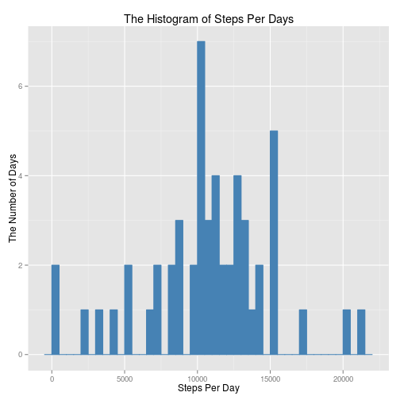
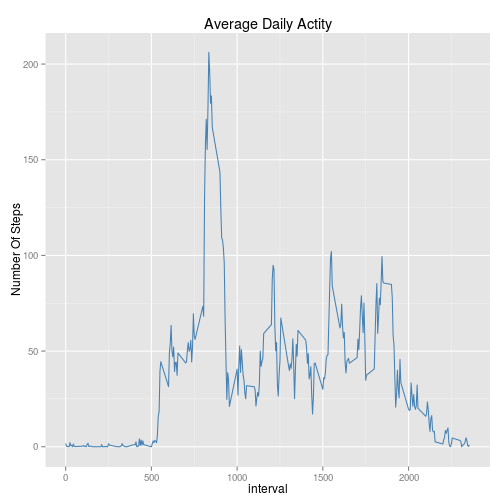
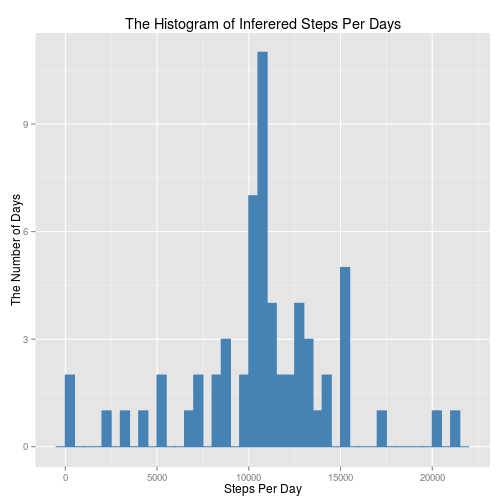
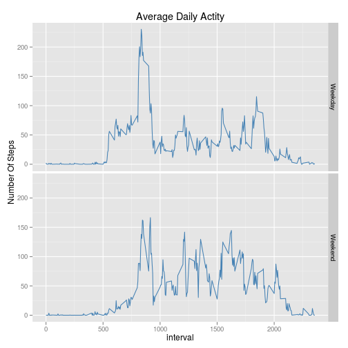

# Reproducible Research: Peer Assessment 1

*by* KiSun SONG

## Loading and preprocessing the data


```r
activity <- read.csv(unz("activity.zip", "activity.csv"), header=TRUE);
nRows <- nrow(activity);
```

17568 rows have been loaded.


## What is mean total number of steps taken per day?


```r
stepsPerDay <- aggregate(steps ~ date, data = activity, sum, na.rm = TRUE);

mean <- mean(stepsPerDay$steps)
median <- median(stepsPerDay$steps)

library(ggplot2);
ggplot(data = stepsPerDay, aes(steps)) + geom_histogram(color="steelblue", fill="steelblue", binwidth=500) + labs(title = "The Histogram of Steps Per Days", x = "Steps Per Day", y ="The Number of Days");
```

 

Brief summary of "The Number of Steps taken per Day".

-Mean : 1.0766 &times; 10<sup>4</sup>

-Median : 10765


## What is the average daily activity pattern?


```r
stepsPerInterval <- aggregate(activity$steps, by = list(interval = activity$interval), mean, na.rm=TRUE);

ggplot(data = stepsPerInterval, aes(interval, x)) + geom_line(color="steelblue") + labs(title = "Average Daily Actity", y="Number Of Steps", x = "interval");
```

 

```r
maxVal = max(stepsPerInterval$x);
maxWhen = stepsPerInterval[which.max(stepsPerInterval$x), 1];
```

Brief summary of "Average Daily Activity Pattern"

-Max the numbef of average steps : 206.1698


-What interval is the most peakest : 835


## Imputing missing values


```r
nMissingData <- sum(is.na(activity$steps));
```

There are 2304 missing Values.


In order to fill in those missing values, All NA values are replaced with average step value on its interval.


```r
inferedActivity <- subset(activity, FALSE);

infer <- function(x) {
  if (is.na(x[1])) {
      x[1] <- stepsPerInterval[stepsPerInterval$interval == as.integer(x[3]), 2];
  } 
  inferedActivity[nrow(inferedActivity) + 1, ] <<- x;
}
t <- apply(activity, 1, infer);

inferedActivity$steps <- as.integer(inferedActivity$steps);
inferedActivity$interval <- as.integer(inferedActivity$interval);

inferedStepsPerDay <- aggregate(steps ~ date, data = inferedActivity, sum, na.rm = TRUE);

ggplot(data = inferedStepsPerDay, aes(steps)) + geom_histogram(color="steelblue", fill="steelblue", binwidth=500) + labs(title = "The Histogram of Inferered Steps Per Days", x = "Steps Per Day", y ="The Number of Days");
```

 

```r
meanNAReplaced <- mean(inferedStepsPerDay$steps)
medianNAReplaced <- median(inferedStepsPerDay$steps)
```

Brief summary of 'The Number of Steps taken per Day(Filled in Missing Values)'.

-Mean : 1.075 &times; 10<sup>4</sup>

-Median : 10641

## Are there differences in activity patterns between weekdays and weekends?


```r
for (i in 1:nrow(inferedActivity)) {
    wday <- as.POSIXlt(inferedActivity$date[i])$wday
    if (wday == 0 | wday == 6) {
      inferedActivity$daytype[i] = "Weekend";
    } else {
      inferedActivity$daytype[i] = "Weekday";
    } 
}

inferedStepsPerDayInterval <- aggregate(inferedActivity$steps,
  by = list(interval = inferedActivity$interval, daytype = inferedActivity$daytype), 
  mean);


ggplot(data = inferedStepsPerDayInterval, aes(interval, x)) + geom_line(color="steelblue") + labs(title = "Average Daily Actity", y="Number Of Steps", x = "interval") + facet_grid(daytype ~ .);
```

 

We can see the differences on Weekdays and Weekedns.


